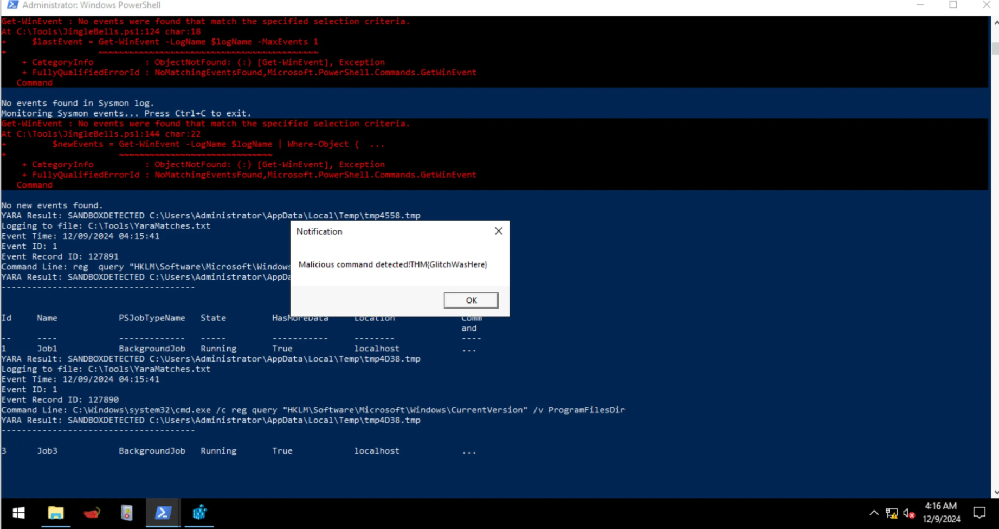
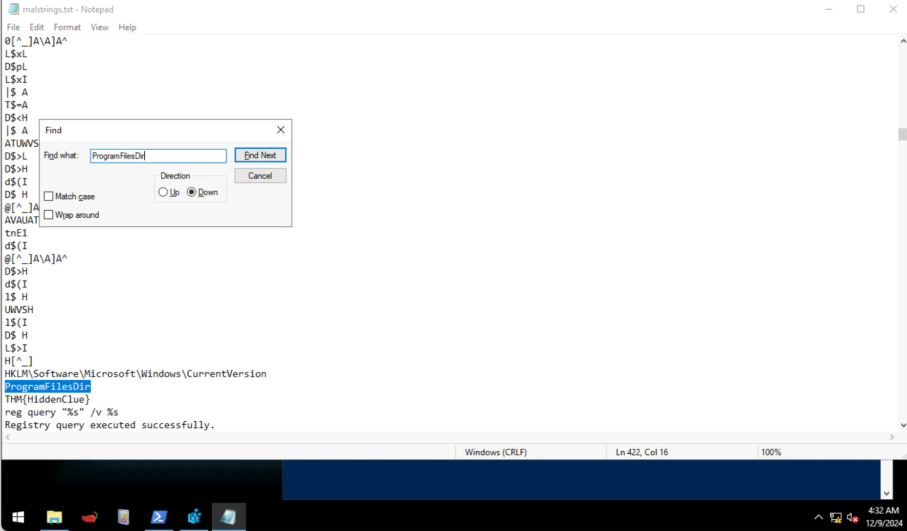
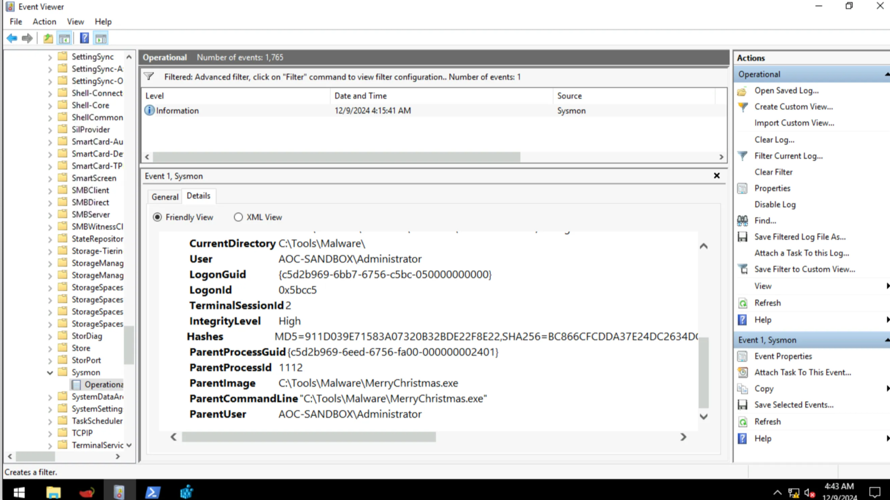

# **TryHackMe Writeup: Day 6 - Sandboxes (Advent of Cyber 2024)**

## **Overview**
- **Room Name**: Day 6: If I can't find a nice malware to use, I'm not going.
- **Difficulty**: Easy
- **Category**: Malware Analysis
- **Objective**: Analyze malware behavior in sandbox environments and bypass detection.
- **Tools**: YARA, Sysmon, Floss, PowerShell

---

## **Table of Contents**
1. [Introduction](#introduction)
2. [Enumeration](#enumeration)
3. [Exploitation](#exploitation)
4. [Post-Exploitation](#post-exploitation)
5. [Conclusion](#conclusion)

---

## **Introduction**

In this challenge, we explore how malware can detect sandbox environments and evade detection using obfuscation techniques. We also learn how to use tools like YARA and Floss to analyze malware behavior, detect malicious patterns, and uncover hidden strings.

---

## **Enumeration**

### Step 1: Analyzing the Malware's Registry Check
The malware checks if it is running in a sandbox by querying the registry path `HKLM\Software\Microsoft\Windows\CurrentVersion` for the `ProgramFilesDir` value. This directory is often absent in sandbox environments.

#### Code Example:
```c
void registryCheck() {
    const char *registryPath = "HKLM\\Software\\Microsoft\\Windows\\CurrentVersion";
    const char *valueName = "ProgramFilesDir";
    char command[512];
    snprintf(command, sizeof(command), "reg query \"%s\" /v %s", registryPath, valueName);
    int result = system(command);
    if (result == 0) {
        printf("Registry query executed successfully.\n");
    } else {
        fprintf(stderr, "Failed to execute registry query.\n");
    }
}
```

This function queries the registry to determine if the environment is a sandbox.

---

## **Exploitation**

### Step 2: Detecting Sandbox Behavior with YARA Rules

YARA rules are used to identify malicious patterns. Below is a sample rule that detects registry queries for `ProgramFilesDir`.

#### YARA Rule:
```yara
rule SANDBOXDETECTED {
    meta:
        description = "Detects the sandbox by querying the registry key for Program Path"
        author = "TryHackMe"
        date = "2024-10-08"
        version = "1.1"
    strings:
        $cmd = "Software\\Microsoft\\Windows\\CurrentVersion\" /v ProgramFilesDir" nocase
    condition:
        $cmd
}
```

This rule monitors Sysmon logs for commands accessing the registry key.

### Step 3: Running the Malware and Monitoring Logs
1. Open PowerShell and navigate to `C:\Tools`.
2. Start the EDR script:
   ```powershell
   PS C:\Tools> .\JingleBells.ps1
   ```
   - The script monitors Sysmon logs for events matching our YARA rule.
3. Execute the malware:
   - Navigate to `C:\Tools\Malware` and double-click on `MerryChristmas.exe`.

#### Screenshot:
  
*This screenshot shows the popup generated by the EDR when it detects the malware querying the registry.*

### Flag from Popup:
- Flag: `THM{GlitchWasHere}`

---

## **Post-Exploitation**

### Step 4: Extracting Hidden Strings with Floss

Floss is a tool that extracts obfuscated strings from binaries.

1. Run Floss on the malware binary:
   ```powershell
   PS C:\Tools\FLOSS> floss.exe C:\Tools\Malware\MerryChristmas.exe | Out-File C:\tools\malstrings.txt
   ```
2. Open `malstrings.txt` and search for relevant strings.

#### Screenshot:
  
*This screenshot shows Floss extracting hidden strings from the malware binary.*

### Flag from Floss Output:
- Flag: `THM{HiddenClue}`

---

### Step 5: Using Sysmon Logs for Further Analysis

Sysmon logs provide detailed information about system activity. To filter logs for specific events:

1. Open PowerShell and view EDR log contents:
   ```powershell
   PS C:\Tools> get-content C:\Tools\YaraMatches.txt
   ```
2. Note down the `EventRecordID` value.
3. Open Windows Event Viewer and navigate to:
   - Applications and Services Logs -> Microsoft -> Windows -> Sysmon -> Operational.
4. Apply a custom filter using the following XML query:
   ```xml
   <QueryList>
       <Query Id="0" Path="Microsoft-Windows-Sysmon/Operational">
           <Select Path="Microsoft-Windows-Sysmon/Operational">
               *[System[(EventRecordID="INSERT_EVENT_RECORD_ID_HERE")]]
           </Select>
       </Query>
   </QueryList>
   ```

#### Screenshot:
  
*This screenshot shows filtered Sysmon logs for events related to the malware.*

---

## **Conclusion**

This challenge demonstrated how malware can detect sandbox environments using registry checks and evade detection with obfuscation techniques. We also learned how to use tools like YARA, Floss, and Sysmon to analyze and detect malicious behavior.

### Key Takeaways:

1. **Sandbox Detection**: Malware often checks for indicators of virtualized environments (e.g., missing directories or processes).
2. **YARA Rules**: Custom rules can effectively detect specific behaviors or patterns in files or logs.
3. **Obfuscation Techniques**: Encoding commands (e.g., Base64) can bypass simple detection mechanisms.
4. **Floss for Analysis**: Tools like Floss help extract hidden information from binaries.
5. **Sysmon Logs**: Detailed event logging aids in tracing malware activity and identifying its impact.

By combining these techniques, analysts can better understand and mitigate threats posed by advanced malware.

---