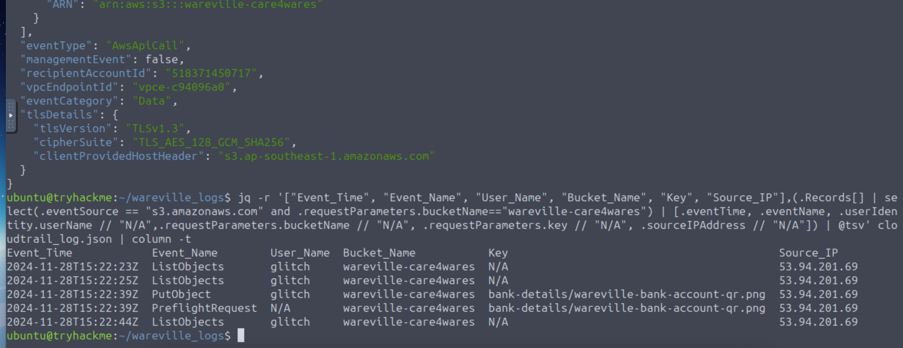
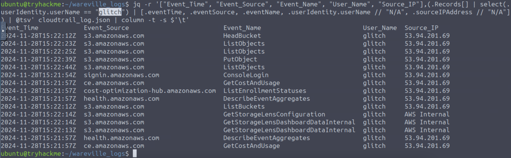
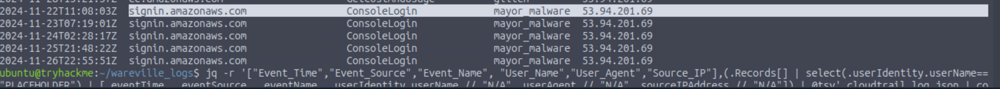
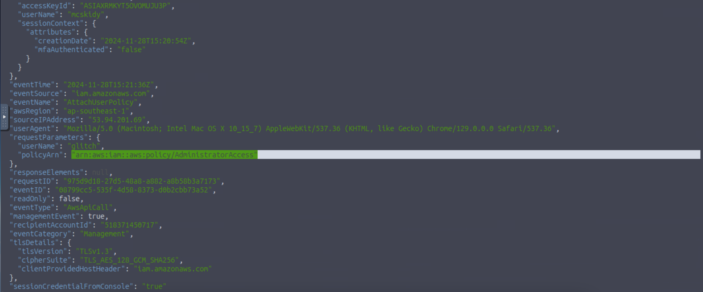
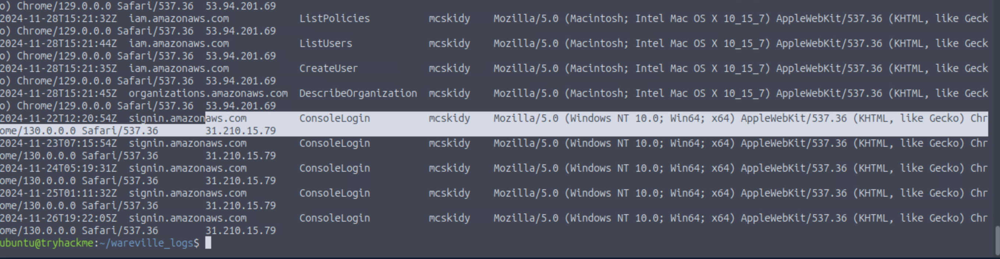
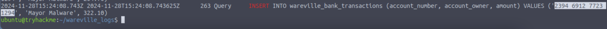

# **TryHackMe Writeup: Day 7 - AWS Log Analysis (Advent of Cyber 2024)**

## **Overview**
- **Room Name**: Day 7: Oh, no. I'M SPEAKING IN CLOUDTRAIL!
- **Difficulty**: Easy
- **Category**: Cloud Security
- **Objective**: Investigate suspicious activity in AWS logs to uncover anomalies and identify malicious behavior.
- **Tools**: AWS CloudTrail, AWS CloudWatch, JQ, Sysmon

---

## **Table of Contents**
1. [Introduction](#introduction)
2. [Enumeration](#enumeration)
3. [Exploitation](#exploitation)
4. [Post-Exploitation](#post-exploitation)
5. [Conclusion](#conclusion)

---

## **Introduction**

In this challenge, we investigate suspicious activity in an AWS environment using CloudTrail and CloudWatch logs. By leveraging tools like JQ for JSON parsing and Sysmon for system monitoring, we analyze logs to uncover anomalies and identify malicious actions taken by an attacker.

---

## **Enumeration**

### Step 1: Investigating the S3 Bucket

The suspicious activity revolves around the S3 bucket `wareville-care4wares`, which contains a digital flyer (`wareville-bank-account-qr.png`). The flyer’s account number was altered, leading to misdirected donations.

#### Command to Filter Relevant Logs:
```bash
jq -r '.Records[] | select(.eventSource == "s3.amazonaws.com" and .requestParameters.bucketName=="wareville-care4wares")' cloudtrail_log.json
```

#### Breakdown of Command:
| Command | Description |
|---------|-------------|
| `jq -r` | Outputs results in raw format instead of JSON. |
| `.Records[]` | Parses the `Records` array in the JSON file. |
| `select(...)` | Filters events related to the S3 bucket `wareville-care4wares`. |

---

## **Exploitation**

### Step 2: Identifying Malicious Actions

From the filtered logs, we observe that a user named `glitch` performed several actions on the S3 bucket, including uploading a modified version of the flyer.

#### Enhanced Command for Tabular Output:
```bash
jq -r '["Event_Time", "Event_Name", "User_Name", "Bucket_Name", "Key", "Source_IP"], (.Records[] | select(.eventSource == "s3.amazonaws.com" and .requestParameters.bucketName=="wareville-care4wares") | [.eventTime, .eventName, .userIdentity.userName // "N/A", .requestParameters.bucketName // "N/A", .requestParameters.key // "N/A", .sourceIPAddress // "N/A"]) | @tsv' cloudtrail_log.json | column -t
```

#### Observations:
- User `glitch` uploaded the file `wareville-bank-account-qr.png` on November 28th.
- The source IP for these actions was `53.94.201.69`.

#### Screenshot:
  
*This screenshot shows a tabular view of log entries related to the suspicious activity.*

---

### Step 3: Analyzing User Activity

To investigate further, we focus on all actions performed by the user `glitch`.

#### Command:
```bash
jq -r '["Event_Time", "Event_Source", "Event_Name", "User_Name", "Source_IP"], (.Records[] | select(.userIdentity.userName == "glitch") | [.eventTime, .eventSource, .eventName, .userIdentity.userName // "N/A", .sourceIPAddress // "N/A"]) | @tsv' cloudtrail_log.json | column -t -s $'\t'
```

#### Observations:
- The user logged into the AWS Management Console (`ConsoleLogin`) on November 28th.
- The user performed actions from IP address `53.94.201.69`.

---

## **Post-Exploitation**

### Step 4: Investigating Account Creation

Further analysis reveals that the user `glitch` was created by McSkidy with administrative privileges.

#### Command to Identify Account Creation:
```bash
jq '.Records[] | select(.eventSource=="iam.amazonaws.com" and .eventName== "CreateUser")' cloudtrail_log.json
```

#### Observations:
- The account was created by McSkidy.
- The newly created user was assigned `AdministratorAccess`.

---

### Step 5: Determining Malicious Intent

The attacker used their access to alter the flyer’s account number to redirect donations to their own account.

#### Command to Extract Bank Account Number:
```bash
grep INSERT rds.log
```

#### Observations:
- The altered bank account number is `2394 6912 7723 1294`.

---
## **Answer Questions Below**

### **What is the other activity made by the user glitch aside from the ListObject action?**
- **Answer**: `PutObject`

#### **Command**:
```bash
jq -r '["Event_Time", "Event_Name", "User_Name", "Bucket_Name", "Key", "Source_IP"], (.Records[] | select(.eventSource == "s3.amazonaws.com" and .requestParameters.bucketName=="wareville-care4wares") | [.eventTime, .eventName, .userIdentity.userName // "N/A", .requestParameters.bucketName // "N/A", .requestParameters.key // "N/A", .sourceIPAddress // "N/A"]) | @tsv' cloudtrail_log.json | column -t
```

#### **Explanation**:
This command filters CloudTrail logs to extract events related to the S3 bucket `wareville-care4wares`. It specifically looks for actions performed by any user (including `glitch`) on this bucket. The output includes:
- Event time
- Event name (e.g., `ListObjects`, `PutObject`)
- User name
- Bucket name
- Key (file name)
- Source IP address

#### **Screenshot**:
  
PutObject Command Output:  
*This screenshot shows that the user glitch performed a `PutObject` action on the S3 bucket.*

---

### **What is the source IP related to the S3 bucket activities of the user glitch?**
- **Answer**: `53.94.201.69`

#### **Command**:
```bash
jq -r '["Event_Time", "Event_Source", "Event_Name", "User_Name", "Source_IP"], (.Records[] | select(.userIdentity.userName == "glitch") | [.eventTime, .eventSource, .eventName, .userIdentity.userName // "N/A", .sourceIPAddress // "N/A"]) | @tsv' cloudtrail_log.json | column -t -s $'\t'
```

#### **Explanation**:
This command isolates all actions performed by the user `glitch` in CloudTrail logs. It outputs:
- Event time
- Event source (e.g., `s3.amazonaws.com`)
- Event name (e.g., `PutObject`, `ListObjects`)
- User name
- Source IP address

#### **Screenshot**:
  
Source IP  
*This screenshot shows that the source IP address for glitch's activities is `53.94.201.69`.*

---

### **Based on the eventSource field, what AWS service generates the ConsoleLogin event?**
- Answer: `signin.amazonaws.com`

#### Command:
```bash
jq -r '["Event_Time", "Event_Source", "Event_Name", "User_Name", "Source_IP"], (.Records[] | select(.sourceIPAddress=="53.94.201.69") | [.eventTime, .eventSource, .eventName, .userIdentity.userName // "N/A", .sourceIPAddress // "N/A"]) | @tsv' cloudtrail_log.json | column -t -s $'\t'
```

#### Screenshot:
  
*This screenshot shows that signin.amazonaws.com is responsible for ConsoleLogin events.*

---

### **When did the anomalous user trigger the ConsoleLogin event?**
- Answer: `2024-11-28T15:21:54Z`

#### Screenshot:
  
*This screenshot shows when glitch triggered a ConsoleLogin event.*

---

### **What was the name of the user that was created by the mcskidy user?**
- Answer: `Glitch`

---

### **What type of access was assigned to the anomalous user?**
- Answer: `AdministratorAccess`

#### Command:
```bash
jq '.Records[] | select(.eventSource=="iam.amazonaws.com" and .eventName== "AttachUserPolicy")' cloudtrail_log.json
```

#### Screenshot:
  
*This screenshot shows that AdministratorAccess was assigned to glitch.*

---

### **Which IP does Mayor Malware typically use to log into AWS?**
- Answer: `53.94.201.69`

#### Command:
```bash
jq -r '["Event_Time","Event_Source","Event_Name", "User_Name","User_Agent","Source_IP"],(.Records[] | select(.userIdentity.userName=="mayor_malware") | [.eventTime, .eventSource, .eventName, .userIdentity.userName // "N/A",.userAgent // "N/A",.sourceIPAddress // "N/A"]) | @tsv' cloudtrail_log.json | column -t -s $'\t'
```

---

### **What is McSkidy's actual IP address?**
- Answer: `31.210.15.79`

#### Command:
```bash
jq -r '["Event_Time","Event_Source","Event_Name", "User_Name","User_Agent","Source_IP"],(.Records[] | select(.userIdentity.userName=="mcskidy") | [.eventTime, .eventSource, .eventName, .userIdentity.userName // "N/A",.userAgent // "N/A",.sourceIPAddress // "N/A"]) | @tsv' cloudtrail_log.json | column -t -s $'\t'
```

#### Screenshot:
  
*This screenshot shows McSkidy's actual IP address.*

---

### **What is the bank account number owned by Mayor Malware?**
- Answer: `2394 6912 7723 1294`

#### Command:
```bash
grep INSERT rds.log
```

#### Screenshot:
  
*This screenshot shows Mayor Malware's bank account number.*

---

## **Conclusion**

This challenge demonstrated how to analyze AWS logs using tools like JQ and Sysmon to uncover malicious activity in a cloud environment.

### Key Takeaways:

1. **CloudTrail Analysis**: CloudTrail provides detailed logs of AWS activity, which are invaluable for investigating security incidents.
2. **JQ for JSON Parsing**: JQ simplifies log analysis by enabling filtering and transformation of JSON data.
3. **Sysmon Integration**: Sysmon enhances visibility into system-level events, complementing cloud-based log analysis.
4. **Proactive Monitoring**: Combining CloudWatch and CloudTrail ensures comprehensive monitoring of both application performance and infrastructure changes.

By leveraging these tools and techniques, security analysts can effectively detect and respond to threats in cloud environments.

---