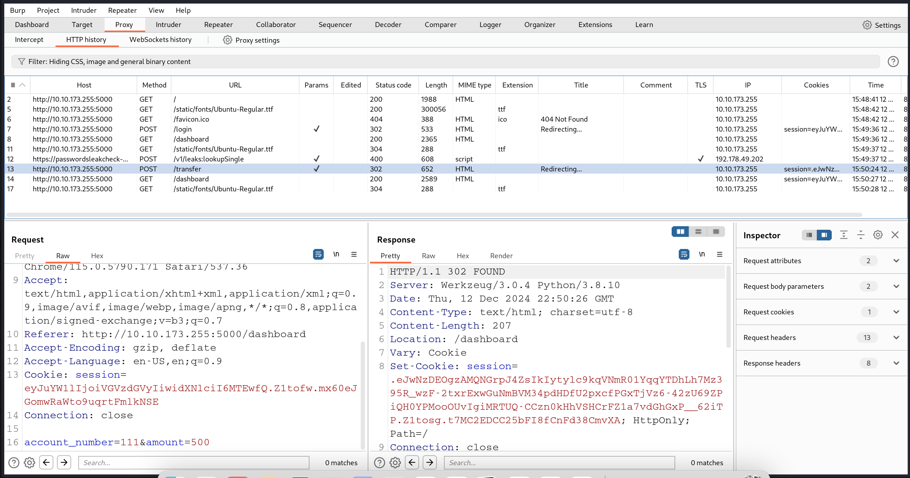
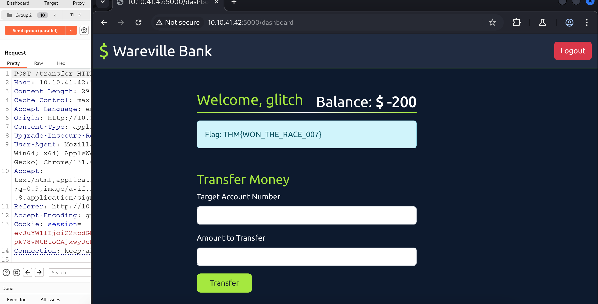

# **TryHackMe Writeup: Day 12 - Web Timing Attacks (Advent of Cyber 2024)**

## **Overview**
- **Room Name**: Day 12: Web Timing Attacks
- **Difficulty**: Medium
- **Category**: Web Security
- **Objective**: Understand how timing attacks can be used to extract sensitive information from web applications and learn how to defend against them.
- **Tools**: Burp Suite, Python, Wireshark

---

## **Table of Contents**
1. [Introduction](#introduction)
2. [Understanding Timing Attacks](#understanding-timing-attacks)
3. [Executing a Timing Attack](#executing-a-timing-attack)
4. [Defending Against Timing Attacks](#defending-against-timing-attacks)
5. [Conclusion](#conclusion)

---

## **Introduction**

Timing attacks exploit the time taken by a system to process certain operations to infer sensitive information. In web applications, these attacks can reveal details like valid usernames or even passwords by analyzing response times. This challenge explores how timing attacks work and provides strategies for mitigating them.

---

## **Understanding Timing Attacks**

### What are Timing Attacks?
Timing attacks are a form of side-channel attack where an attacker measures the time it takes for a system to execute operations. Even small variations in time can leak information about the data being processed.

### Types of Timing Attacks:
1. **Direct Timing Attacks**: Measure the time taken by a server to respond to requests directly.
2. **Cross-Site Timing Attacks**: Use a malicious site to measure the time it takes for another site to respond from the user's perspective.

#### Example:
A login page might take slightly longer to respond when a correct username is entered compared to an incorrect one, allowing attackers to infer valid usernames.

---

## **Executing a Timing Attack**

### Exploit Time-of-Check to Time-of-Use (TOCTOU) Flaw

#### Step 1: Setting Up the Environment

1. **Intercept Traffic using Burp Suite**:
   - Configure your browser to route traffic through Burp Suite.
   - In Burp's browser settings, enable "Allow Burp's browser to run without a sandbox."
   - Use the proxy tab in Burp Suite and open the browser to access the URL `http://10.10.41.42:5000`.
   - Log in with Account No: 110, Password: tester.
   - Perform a sample transaction by sending $500 to account 111.
   - In the HTTP history under the proxy tab, locate the POST request for `/transfer`.
   - Observe that the `/transfer` endpoint accepts POST requests with parameters `account_number` and `amount`.
   - Use Burp Suite's Repeater feature to duplicate and send multiple HTTP POST requests.
   - Duplicate the request 10 times for testing and group them under "funds."
   - Optionally, install Turbo Intruder from BApp store for enhanced request handling.
   - Launch multiple copies of HTTP POST requests simultaneously using "Send group (parallel)" option.
   - Check the tester account balance after sending requests; it should be negative due to exploiting the race condition.

#### Screenshot:
     
   *This screenshot shows the HTTP POST request being sent to Repeater.*

#### Verifying Through Source Code
If you have access to the application's source code, you can identify potential race condition vulnerabilities through code review:

```python
if user['balance'] >= amount:
    conn.execute('UPDATE users SET balance = balance + ? WHERE account_number = ?', 
                 (amount, target_account_number))
    conn.commit()

    conn.execute('UPDATE users SET balance = balance - ? WHERE account_number = ?', 
                 (amount, session['user']))
    conn.commit()
```

The above code lacks proper transaction handling, making it vulnerable to race conditions as concurrent requests can interfere with balance updates.

#### Time for Some Action
To validate this vulnerability using account number: 101 and password: glitch:

- Log in with account 101 and password: glitch.
- Transfer $200 from account 101 to account 111.
- Find the HTTP POST `/transfer` request, send it to repeater, duplicate it 10 times, and repeat.
- Once complete, you will receive a flag.

#### Screenshot:
  
*This screenshot shows the flag by exploiting the (TOCTOU) Flaw.*

---

## **Conclusion**

This exercise demonstrates how timing attacks can exploit vulnerabilities in web applications and highlights the importance of secure coding practices.

---

## **Answer the Questions Below**

What is the flag value after transferring over $2000 from Glitch's account?
- THM{WON_THE_RACE_007}