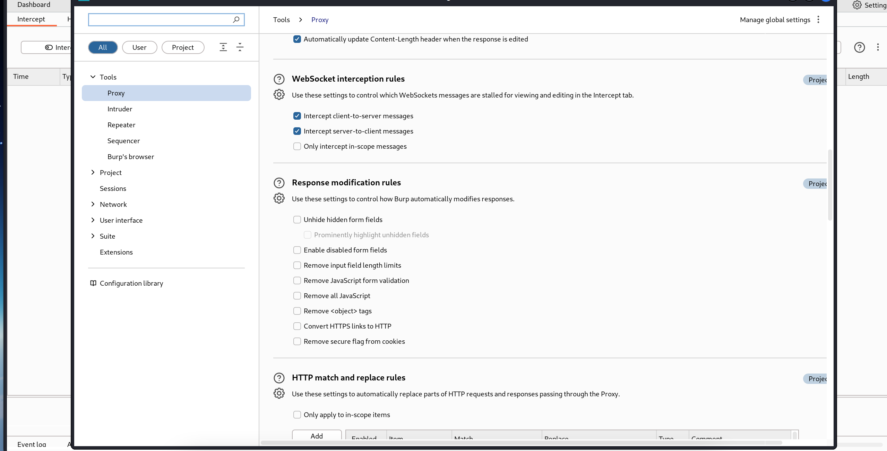
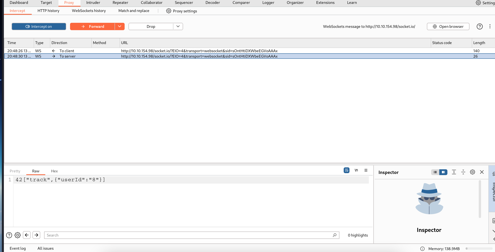
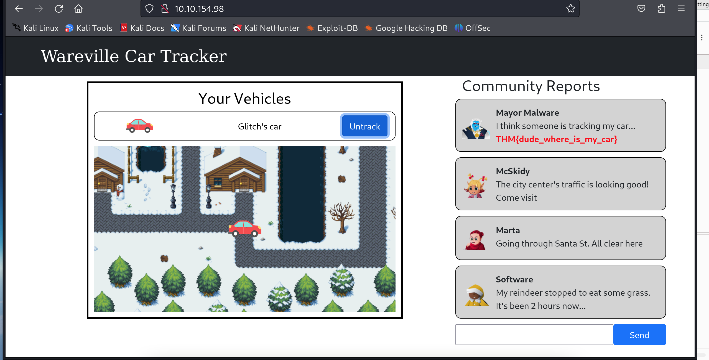
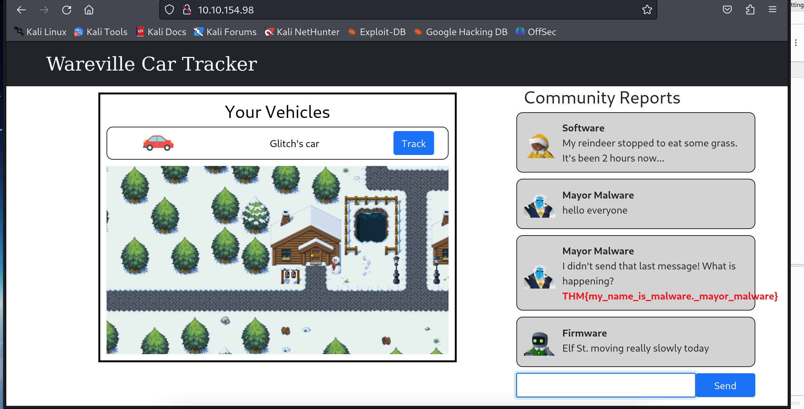

# **TryHackMe Writeup: Day 13 - WebSockets (Advent of Cyber 2024)**

## **Overview**
- **Room Name**: Day 13: It came without buffering! It came without lag!
- **Difficulty**: Medium
- **Category**: Web Security
- **Objective**: Learn about WebSocket vulnerabilities and how to exploit them.
- **Tools**: Burp Suite, FoxyProxy

---

## **Table of Contents**
1. [Introduction](#introduction)
2. [Understanding WebSockets](#understanding-websockets)
3. [WebSocket Vulnerabilities](#websocket-vulnerabilities)
4. [Exploitation](#exploitation)
5. [Conclusion](#conclusion)

---

## **Introduction**

WebSockets provide a persistent connection between a client and server, allowing for real-time data exchange. While they offer performance benefits, they also introduce security risks if not properly secured. This challenge explores WebSocket vulnerabilities and demonstrates how to manipulate WebSocket messages to exploit these weaknesses.

---

## **Understanding WebSockets**

### What are WebSockets?
WebSockets enable continuous two-way communication between a client and server over a single, long-lived connection. Unlike traditional HTTP, which requires a new connection for each request/response cycle, WebSockets maintain an open channel for ongoing data exchange.

### Benefits of WebSockets:
- Reduced latency due to persistent connections.
- Efficient real-time data transfer.
- Lower overhead compared to HTTP polling.

---

## **WebSocket Vulnerabilities**

### Common Vulnerabilities:
1. **Weak Authentication and Authorization**:
   - Lack of built-in authentication mechanisms can allow unauthorized access.
   
2. **Message Tampering**:
   - Unencrypted messages can be intercepted and altered by attackers.

3. **Cross-Site WebSocket Hijacking (CSWSH)**:
   - Attackers can trick a user's browser into opening a WebSocket connection to another site.

4. **Denial of Service (DoS)**:
   - Persistent connections can be targeted by DoS attacks, overwhelming the server.

### WebSocket Message Manipulation:
Attackers can intercept and modify messages sent between a client and server, potentially altering data or executing unauthorized actions.

---

## **Exploitation**

### Step 1: Setting Up the Environment

1. **Enable FoxyProxy** to route traffic through Burp Suite.
2. **Open Burp Suite** and configure it to intercept WebSocket traffic:
   - Navigate to Proxy > Intercept > Proxy Settings.
   - Ensure interception is enabled for both client-to-server and server-to-client messages.

#### Screenshot:
  
*This screenshot shows Burp Suite configured to intercept WebSocket traffic.*

### Step 2: Manipulating WebSocket Messages

1. **Navigate to the Reindeer Tracker app** at `http://10.10.154.98`.
2. Click the track icon on Glitch's car to initiate a WebSocket connection.
3. In Burp Suite, locate the intercepted message in the WebSockets tab.
4. Change the `userId` parameter from `5` to `8` in the message payload.
5. Forward the modified message back to the server.

#### Screenshot:
  
*This screenshot shows the manipulation of a WebSocket message to change the user ID.*

### Step 3: Observing Results

1. Return to the browser and check the community reports on the Reindeer Tracker app.
2. The manipulated request should now track user ID `8`, revealing Flag1.

#### Flag1:
```
THM{dude_where_is_my_car}
```

#### Screenshot:
  
*This screenshot shows Flag1 retrieved after manipulating the WebSocket message.*

### Step 4: Further Exploitation

1. Test for additional message manipulation possibilities, such as posting with different user IDs.
2. Observe any changes in application behavior or data exposure.

#### Flag2:
```
THM{my_name_is_malware._mayor_malware}
```

#### Screenshot:
  
*This screenshot shows Flag2 retrieved after further exploitation.*

---

## **Conclusion**

WebSockets offer powerful real-time communication capabilities but also introduce security risks if not properly managed.

### Key Takeaways:
1. Ensure robust authentication and authorization mechanisms for WebSocket connections.
2. Encrypt messages to prevent tampering and interception.
3. Regularly monitor for unusual activity that may indicate exploitation attempts.

By understanding these vulnerabilities and implementing appropriate defenses, developers can secure their applications against potential threats.

---