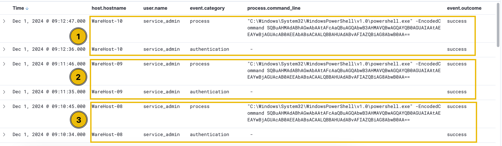
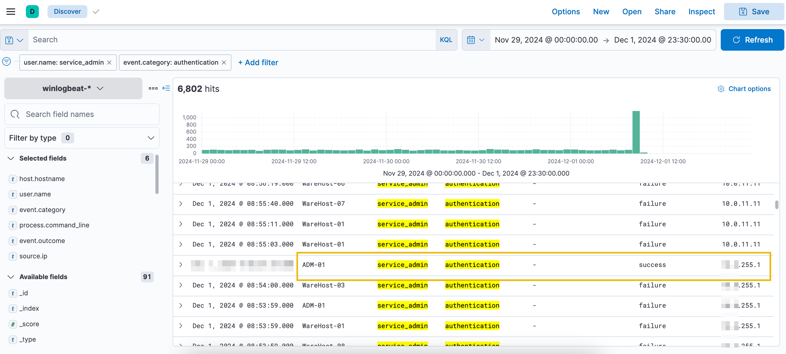
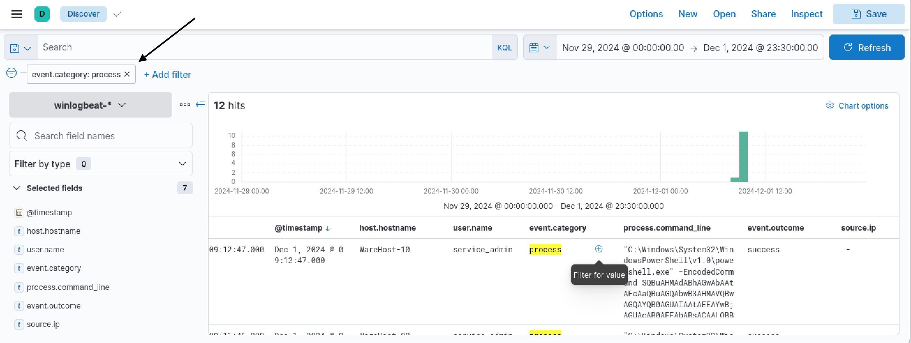
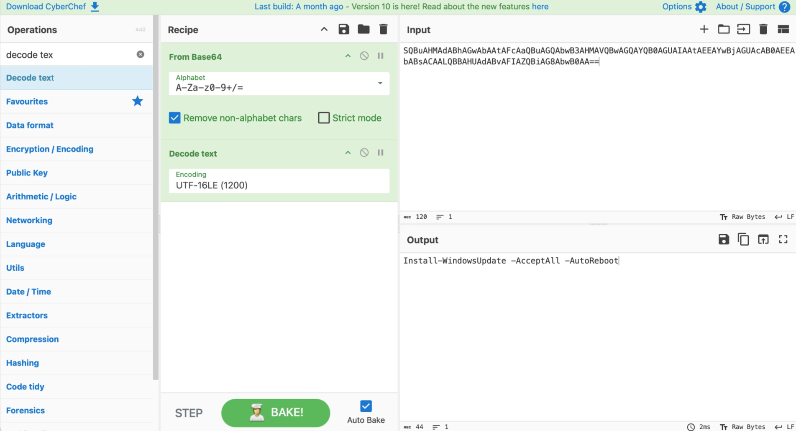
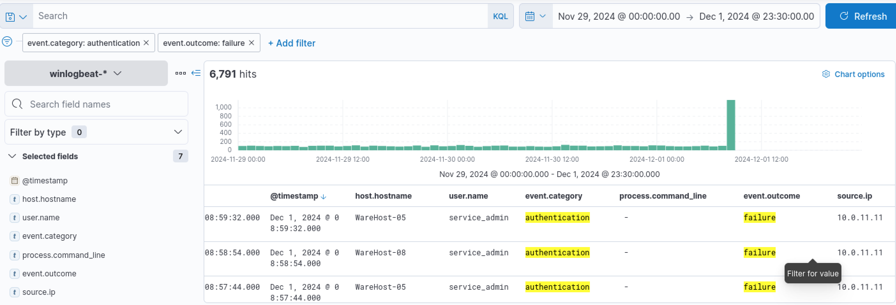
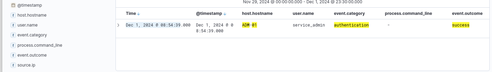

# **TryHackMe Writeup: Day-2-Log-Analysis**

## **Overview**
- **Room Name**: Day 2: One man's false positive is another man's potpourri.
- **Difficulty**: Easy
- **Category**: Log Analysis
- **Objective**: Analyze logs using Elastic SIEM to differentiate between true positives (TPs) and false positives (FPs) while investigating suspicious PowerShell activity.

---

## **Table of Contents**
1. [Introduction](#introduction)
2. [Enumeration](#enumeration)
3. [Analysis](#analysis)
4. [Findings](#findings)
5. [Decoded Command](#decoded-command)
6. [Conclusion](#conclusion)

---

## **Introduction**
In this challenge, we investigate suspicious PowerShell activity across multiple machines in Wareville using Elastic SIEM. The goal is to identify whether the observed activity is malicious (True Positive) or benign (False Positive). Along the way, we analyze authentication events, source IPs, and PowerShell commands to uncover the truth behind the alerts.

---

## **Enumeration**
### Tools Used:
- Elastic SIEM
- CyberChef

### Key Fields for Analysis:
To investigate PowerShell events, the following fields were added as columns in Elastic SIEM:
1. **`host.hostname`**: Identifies the hostname where the command was executed.
2. **`user.name`**: Displays the user who performed the activity.
3. **`event.category`**: Ensures we focus on relevant event categories.
4. **`process.command_line`**: Shows the actual PowerShell commands executed.
5. **`event.outcome`**: Indicates whether the activity succeeded or failed.
6. **`source.ip`**: Reveals the IP address associated with the activity.

### Observations:
1. Encoded PowerShell commands were executed on multiple machines.
2. Each execution was preceded by a successful authentication event.
3. The time difference between logins and command executions was minimal, suggesting automation or scripting.

PowerShell Events
  
     
---

## **Analysis**
### Step 1: Investigating Authentication Events
We filtered for authentication events using the field `event.category`. Expanding the time range revealed over 6800 events between November 29th and December 1st, with a spike in failed logins on December 1st.

Authentication Events


Key Findings:
1. The account causing failed logins was `service_admin`.
2. A brute-force attack was observed from IP `10.0.255.1`.

### Step 2: Filtering by Source IP
Filtering by `source.ip`, we identified that successful logins and subsequent PowerShell commands originated from IP `10.0.255.1`. This suggests that a single actor was responsible for both activities.

### Step 3: Decoding PowerShell Commands
The encoded PowerShell command found in `process.command_line` was:
```plaintext
C:\Windows\System32\WindowsPowerShell\v1.0\powershell.exe -EncodedCommand SQBuAHMAdABhAGwAbAAtAFcAaQBuAGQAbwB3AHMAVQBwAGQAYQB0AGUAIAAtAEEAYwBjAGUAcAB0AEEAbABsACAALQBBAHUAdABvAFIAZQBiAG8AbwB0AA==
```
event.category: process


Using CyberChef, we decoded this Base64 string with the following steps:
1. Dragged "From Base64" and "Decode Text" recipes into CyberChef's recipe panel.
2. Set "Decode Text" to UTF-16LE (1200), as used by PowerShell.

Decoded Command:
```plaintext
Install-WindowsUpdate -AcceptAll -AutoReboot
```

Decoded Command in CyberChef


---

## **Findings**
### Key Observations:
1. The failed login attempts (6701) were caused by outdated credentials in a script run by `service_admin`.
2. A brute-force attack from IP `10.0.255.1` successfully logged into `ADM-01` on December 1, 2024, at `08:54:39`.
3. The attacker executed a PowerShell command to install Windows updates and fix credentials.

### Villain or Hero?
Upon further investigation, it was revealed that Glitch—initially suspected of malicious activity—was actually helping secure Wareville's defenses by fixing outdated credentials using legitimate commands.

---

## **Decoded Command**
The decoded PowerShell command executed by Glitch was:
```plaintext
Install-WindowsUpdate -AcceptAll -AutoReboot
```

This command updated systems and resolved credential issues, preventing further failed login attempts.

---

## **Conclusion**
This challenge highlighted the importance of log analysis in distinguishing between malicious and benign activity:
1. Brute-force attacks can sometimes mask legitimate intentions.
2. Proper filtering and decoding techniques are essential for accurate incident analysis.
3. Not all alerts are what they seem—context is crucial in determining true positives versus false positives.

By carefully analyzing logs and decoding suspicious commands, we uncovered that Glitch was not an attacker but a hero who helped secure Wareville's defenses.

---

## **Flags Retrieved**
1. **What is the name of the account causing all the failed login attempts?**
   - `service_admin`
2. **How many failed logon attempts were observed?**
   - `6791`
   
3. **What is the IP address of Glitch?**
   - `10.0.255.1`
4. **When did Glitch successfully logon to ADM-01?**
   - `Dec 1, 2024 08:54:39`
   
5. **What is the decoded command executed by Glitch?**
   - `Install-WindowsUpdate -AcceptAll -AutoReboot`
